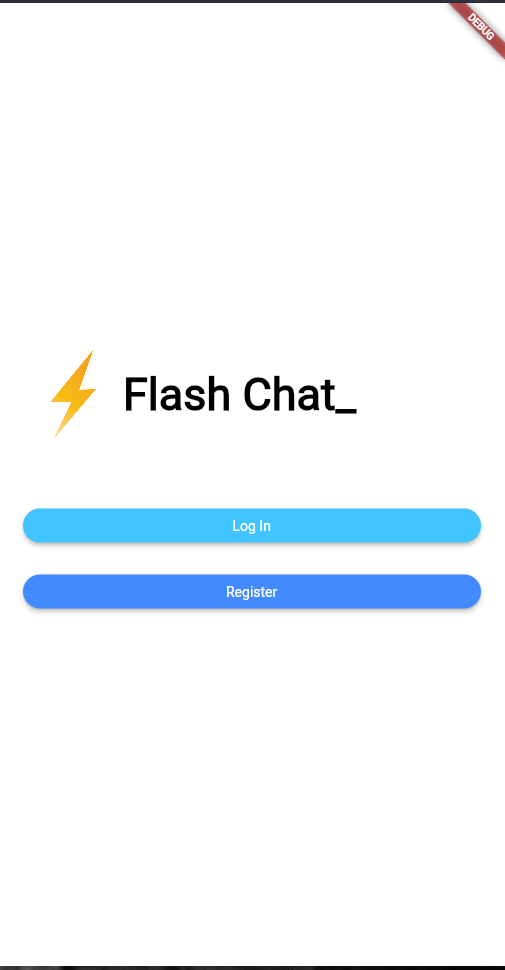
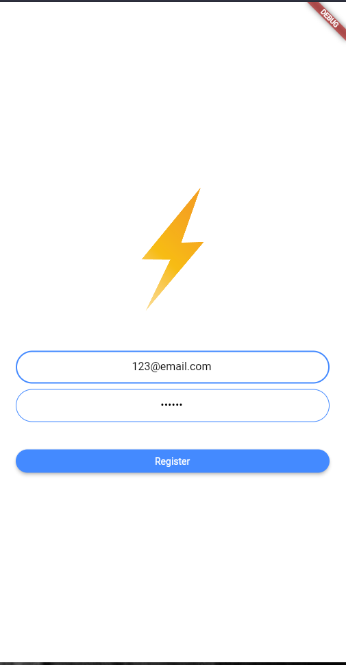
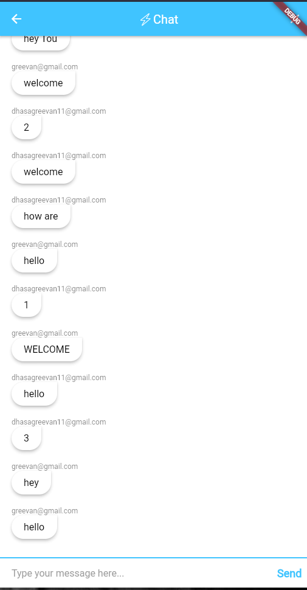
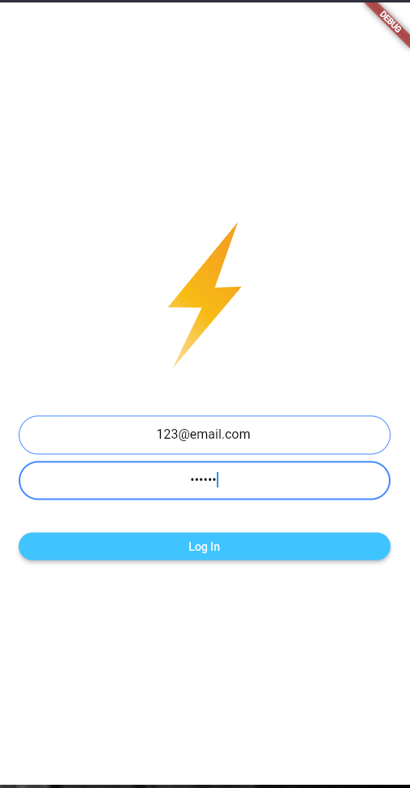
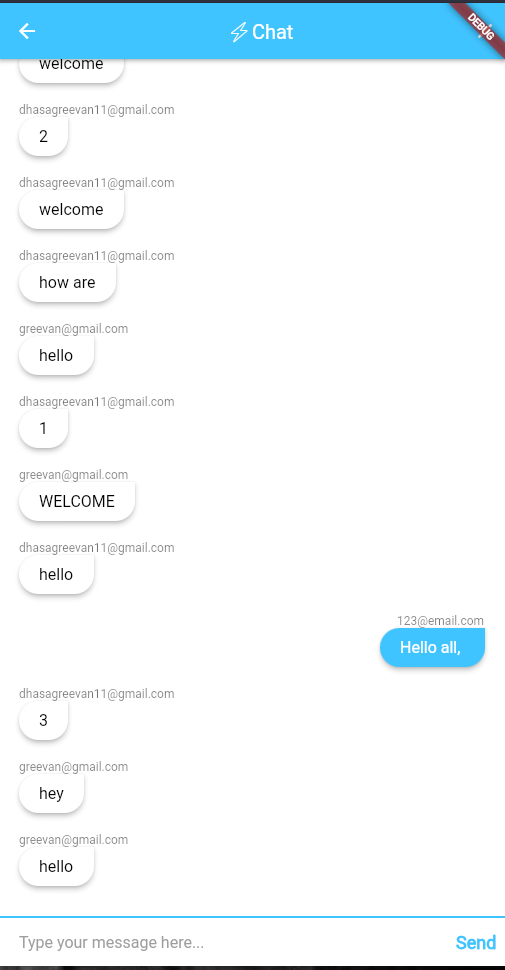

# flash_chat
 This is a flutter app called FlashChat. This app is used to REGISTER, LOGIN and START messaging as a group. It utilises Google's Firebase as database.

## Getting Started

Setting Up the Project :        
Step 1 : Clone the project or Download the project as Zip.      
Step 2 : Open your VS code or IDE with flutter extension installed and SDK setted previously.       
Step 3 : Open this project.     
Step 4 : Open your terminal and type 'flutter pub get', this gets the dependencies.     
Step 5 : Run the project with the command, 'flutter run'

## Screenshots :        

